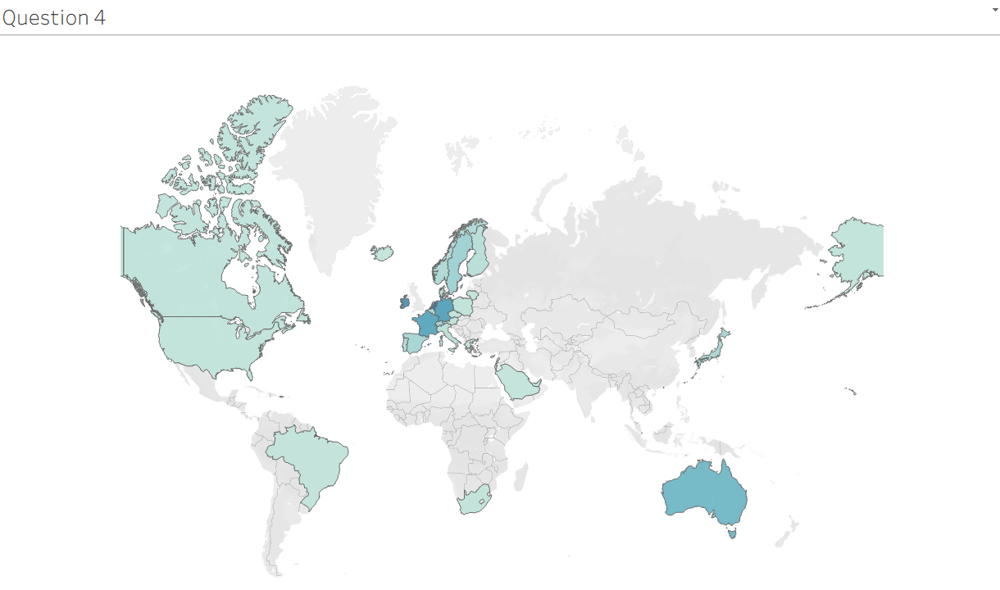

# Online Retail Sales Analysis

## Project Overview
This project analyzes online retail sales data to help executives understand revenue trends, customer behavior, and global demand patterns.

The analysis was conducted using Tableau and focuses on insights that can support strategic decisions and expansion planning.

## Data Cleaning
Before performing the analysis, the dataset was cleaned by applying the following rules:
- Removed rows where Quantity < 1 (product returns).
- Removed rows where UnitPrice < 0 (incorrect entries).

## Visualizations

### Question 1 – Revenue Trend (2011)
A line chart showing monthly revenue trends for the year 2011.

### Question 2 – Top 10 Countries by Revenue
A side-by-side bar chart comparing revenue and quantity sold for the top 10 countries (excluding the United Kingdom).

### Question 3 – Top 10 Customers by Revenue
A vertical bar chart showing the highest revenue generating customers.

### Question 4 – Global Demand by Country
A map visualization highlighting countries with the highest product demand.

## Tools Used
- Tableau
- Data Cleaning
- Data Visualization

## Dashboard Preview

